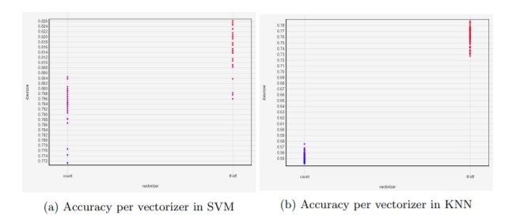
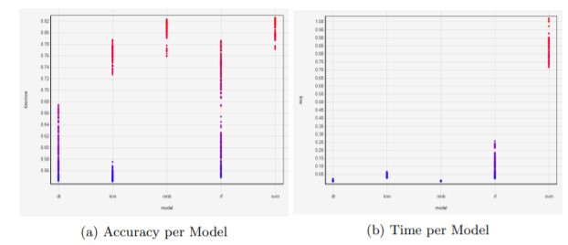
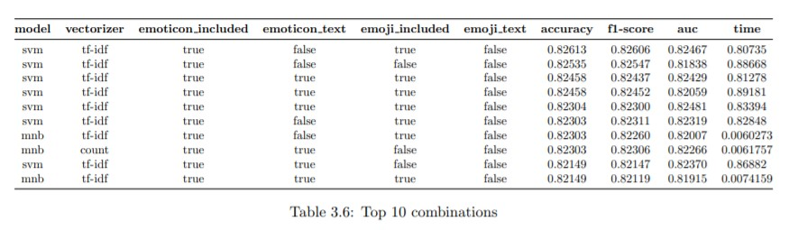
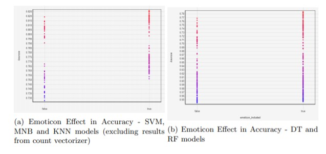

<h1 align="center">Exploring how emojis and emoticons affect sentiment analysis</h1>
<h4 align="center">Final project of Research Methodology course of the EIT Digital data science master at <a href="https://www.kth.se/en">KTH</a></h4>

    
  
  

Research to study how the inclusion of pictograms, such as emoticons and emojis, affects the sentiment analysis performed by machine learning classification algorithms. The two notebooks used for the implementation can be found in the folder [notebooks](notebooks), one regarding data preparation implemented using R and the other involving the training and evaluation of the classification models. Furthermore, the **full report** can be found on [docs](docs/report.pdf).

## Abstract
In the 21st century, communication has shifted due to the spread of new technologies and social networks. In order to highlight their emotions, people often resort to pictograms, such as emoticons and emojis. With the increase in the number of messages exchanged on the Internet, the interest in understanding the emotions of users also rises, leading to the development of Natural Language Processing (NLP) techniques that help to analyze the sentiment polarity of a text. However, there is no agreement regarding the inclusion of pictograms in the analysis. The existing research does not provide any clear and definitive results regarding the impact of emojis and emoticons in the sentiment analysis, due to either the datasets or methodology chosen.

This research aims to investigate the impact of emojis and emoticons in sentiment analysis. The experiments were conducted using a public dataset of [American airlines Twitter reviews](https://www.kaggle.com/crowdflower/twitter-airline-sentiment), which were manually labeled into three categories: positive, neutral, and negative. After thorough preprocessing and feature extraction stages, several versions of training and test sets were created, such as keeping or removing the pictograms, transforming them into words, etc.
    
The data was used to train a collection of machine learning techniques, such as Support Vector Machine (SVM), Multinominal Naive Bayes (MNB), K-Nearest Neighbors (KNN), Decision Tree (DT), and Randon Forest (RF). Finally, the trained models were evaluated according to performance metrics (accuracy, f1-score, AUC, and time) to define the best configuration.

## Theoretical Framework
The literature review was focused mostly on sentiment analysis studies that were using machine learning classifiers. In [Sokalkidis et al.](https://ieeexplore.ieee.org/abstract/document/6927613/), it was proved that emoticons, and especially keywords related to particular emotions (love, joy, sadness, and anger), could improve sentiment analysis. In the experiments, a corpus of 750.000 automatically labeled Greek forum messages was processed and used to train several ML classifiers (e.g., MNB, Bernoulli Naive Bayes (BNB), Logistic Regression (LR), SVM, and KNN), reaching a 77% and 93% of accuracy in average, using emoticons and keywords as features respectively. 

A similar study was performed by [LeCompte and Chen](https://ieeexplore.ieee.org/abstract/document/8560896/), where the researchers were trying to classify 54.000 tweets into seven broad emotional classes (sad, angry, happy, scared, thankful, surprised, and love), labeling the data using a method proposed by [Wang et al.](https://ieeexplore.ieee.org/abstract/document/6406313/). Once the data was processed, several training sets were generated, including or excluding emojis from the analysis, or by using unigram or bigram features. The sets were used to train MNB and SVM models. The best results were achieved by an MNB model using unigram features (63.5% accuracy in case the emojis were ignored and 64.2% when emojis were included in the training phase).

In [another study](http://ceur-ws.org/Vol-2328/3_3_paper_10.pdf), the emojis were confronted with the slang words used on Chinese social networks. A dataset composed of 3000 posts, labeled in "humorous" and "non-humorous" classes, was used to train a wide range of classification algorithms, including also ML techniques, such as LR, SVM, NB, KNN, RF, and DT. The best performance was achieved by SVM, and emojis were leading to better results than slang features (f1-score of 73.77% and 72.61% respectively), however, the best results were achieved by combining both types of features (74.74%). 

Another [group of researchers](https://ieeexplore.ieee.org/abstract/document/8169892/) studied how sarcasm can be detected using sentiment analysis techniques. A collection of 2000 tweets, labeled into two classes ("sarcastic" and "non-sarcastic"), was used to train DT, RF, Gradient Boosting, Adaboost, LR, and NB classifiers. The best results were achieved by using the Adaboost ensemble technique, reaching 81,7% accuracy, when emojis and slang were labeled with more common words, and 80,2% when emojis and slang were left untouched. 

The impact of the emoticons in sentiment analysis was also analyzed by [Palsson and Szersze](https://www.diva-portal.org/smash/record.jsf?pid=diva2%3A930520&dswid=6948), using a dataset of 4200 manually labeled tweets. Among ML techniques, BNB and SVM were chosen. The models were trained using two types of training sets, one in which emoticons were untouched and another one where they were substituted with a word label. The best performance among ML techniques was achieved by SVM with an f1-score of 65,5%, in case the emoticons were transformed into words.
    
## Conclusions
After analyzing the models individually, it is interesting to have a general view of how these models performed and compare them against each other. With respect of the different vectorizers used, two different clusters of models were found. The MNB, DT and RF models performed similarly in terms of precision and recall. On the other side, KNN and SVM models tf-idf obtained significantly better results.

As a general overview regarding the performance of each model, in terms of accuracy and f1-score, both MNB and SVM have similar results, around 80% in both metrics. However, in terms of speed, MNB was around 140 times faster than SVM. Hence in the trade-off accuracy-time, the model that performed better was MNB.

Finally, regarding the research question of how the pictograms affected the models, the addition of emoticons gave better results in the SVM, MNB and KNN models, while it did not show significant variation in the DT and RF models. On the other hand, the inclusion of emojis only showed a significant improvement in the KNN model, around 0.2%, while in all the other models it obtained worse results. In addition, with respect to the representation of these pictograms, in all the models, most of the best results were obtained using a graphic rather than a textual representation.

## Discussion
The results of the experimentation demonstrated that pictograms could be used to improve sentiment analysis. Out of the five machine learning classifiers tested, three of them (SVM, MNB, and KNN) had a significant improvement when adding emoticons, while regarding the inclusion of emojis only KNN obtained better results. Hence, emoticons can be used to better reflect the sentiment of a text, perhaps because nowadays a lesser variety of them is used and emojis can have different meanings, including also the use of irony or sarcasm.

Regarding the preprocessing techniques, the results indicate that some models perform better using the tf-idf vectorizer as input (SVM, KNN), while others have similar results using the counter vectorizer. In respect of the label used to classify the texts, the binary encoding (where neutral texts were considered as positive) worked significantly better in comparison with the numerical encoding. The experiments also showed how the input data can be transformed to obtain better results in tweets and which machine learning classifiers performed better on the selected American Airline Twitter dataset.

Comparing to the previous studies presented in the report, the results were partially in line with what was achieved previously. Similarly to other research, the best performant classifiers were MNB and SVM, with 82.3% and 82.6% accuracy respectively. However, the cross-validation and hyper-tuning helped improve the accuracy by at least 0.8% compared to previous results on other datasets. While it was found that emoticons do improve sentiment analysis, emojis, on the other hand, carried worse results, increasing the accuracy by approximately 0.1%, which was an unexpected outcome and would require further investigation to understand the causes of such behavior. 

As future lines of work, it would be interesting to test these results with a larger dataset and also with a higher density of pictograms. During the dataset research, it was found that currently there are no large datasets that have been manually annotated and that contain a large density of emoticons or emojis. Hence, it is suggested to build a dataset that meets these criteria by extracting text from Twitter and manually assigning the sentiment of each tweet. This could help with future research in the area regarding pictograms and sentiment analysis. Additionally, since the preprocessing was performed before the dataset split, it would be recommended to check better some of the preprocessing steps for the textual data, guaranteeing that the models are trained using only the statistical properties of training data and not also of the test or validation sets. Besides that, it could also be useful to study how Deep Learning models would perform in this task, as well as to test more combinations of hyper-parameters for the presented models. 

## Authors
- Serghei Socolovschi [serghei@kth.se](mailto:serghei@kth.se)
- Angel Igareta [alih2@kth.se](mailto:alih2@kth.se)
